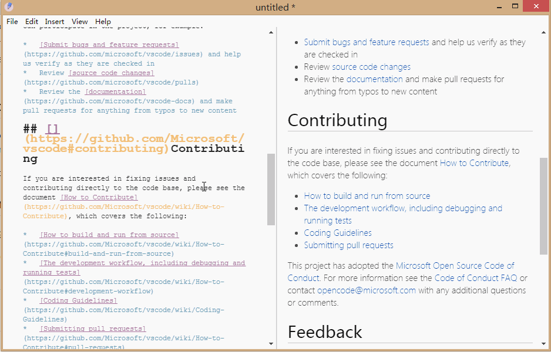
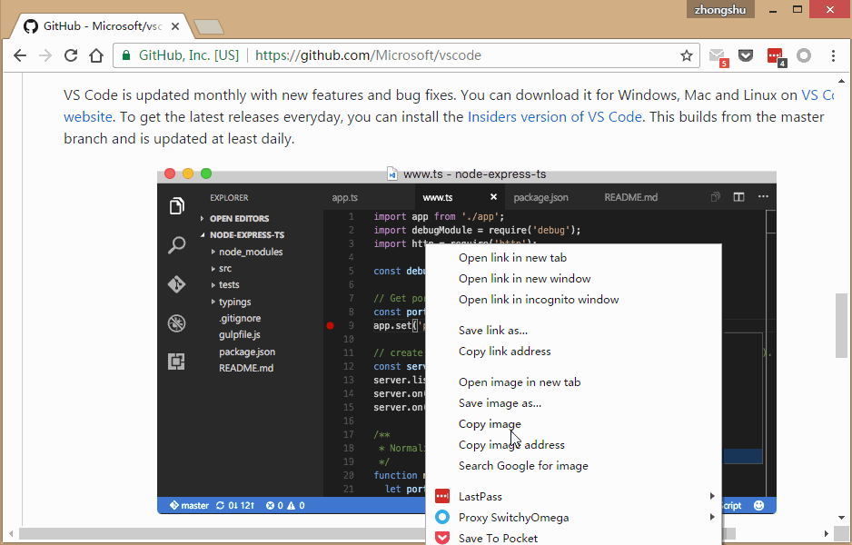
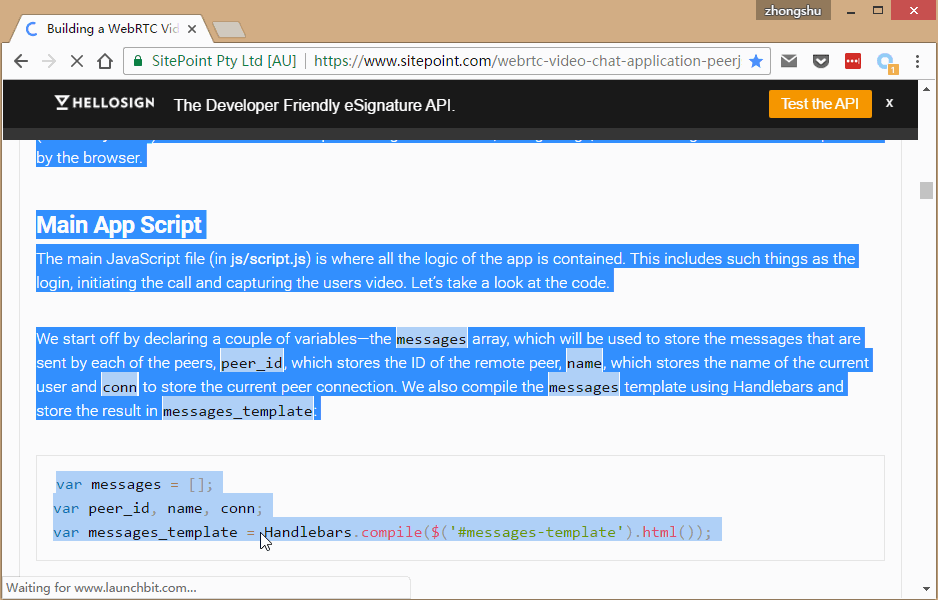
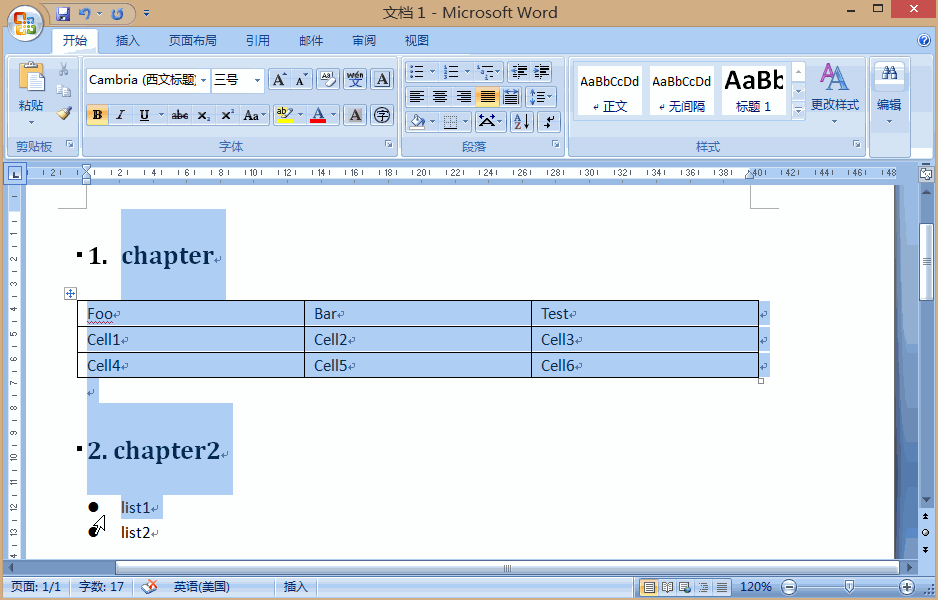

# justmd
Simple markdown editor based on electron.

## sync scroll


## paste image 


## paste html


## paste word



## more
* UML/flow chart support, [more](https://github.com/skanaar/nomnoml) 
* Tex math support, [more](https://github.com/Khan/KaTeX)
* export html
* export pdf
* optimized performance for large file edit


## install & run
After [download](https://github.com/i38/justmd/releases), unzip and run justmd

# develop
for devloper, need node.js and electron installed, then:

* npm install
* npm start

## build
before build:
set 

```
ELECTRON_MIRROR=http://npm.taobao.org/mirrors/electron/
```

for windows:
```
npm run package-x64
```
or
```
npm run package-x86
```

for osx package(must under osx):
```
npm run package-osx
```

## todo
* osx paste html
* splitter
* sequence https://bramp.github.io/js-sequence-diagrams/
* flow http://flowchart.js.org/ 

# License

Copyright (c) 2017-present i38.me

[MIT License](http://en.wikipedia.org/wiki/MIT_License)